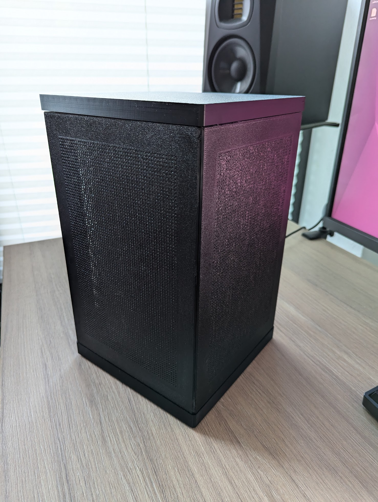
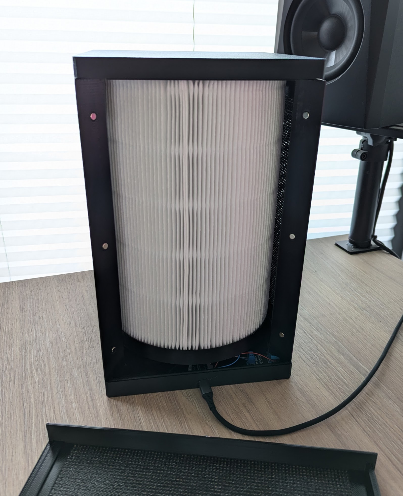

# Smart Air Filter

 

I wanted an air filter that is **cheap**, compatible with **Home Assistant**, and most importantly, **cheap to maintain**. So I went looking for filters that have a **low price per surface area** and are **widely available**.

I chose the [Blueair Blue Pure 411](https://s.click.aliexpress.com/e/_Dk1etKp) filters. They are very cheap and can be bought from many different vendors.

Any 120mm x 25mm fan should fit into the enclosure.

## Hardware

The device is printed from 4 parts:

- Top plate

- Bottom plate

- Fan adapter plate

- Side plate (4 needed)

The sides can be glued together, or held together using magnets. I glued all but one side - that one I attached with **12 6x10mm pin magnets**.

The case can also be flipped if you attach some large enough self-adhesive rubber feet; this is what I do.

## Electronics

To run the fan, you can chose any solution that you want, i.e. "non-smart" and directly powered, or anything else.

I chose the following:

- 5V PWM-controllable fan (mine draws 0,36A)
  
   - *Note: You could also use a two-wire fan if it is PWM-tolerant (not all are), but then you will need a MOSFET to do the PWM for you. So it is easier to go with a 4 wire fan.*

- XIAO ESP32-C3
  
   - *This one fits nicely into the case. You can use other boards, but you will need to adapt the software for your board.*

When plugged in by USB, the fan can draw the power directly from the ESPs 5V pin because the pin is directly bridged to the USB power. Up to 0,4A should be fine, maybe even a little more. The PWM pin can be attached to XIAOs D0 pin.

## Software

On the ESP I installed MQTT software, so it can be used to turn on/off the filter with Home Assistant, as well as control the speed of the fan. Installation instructions:

- Clone this repository.

- Open the `software/` folder in VSCode with Platformio plugin.

- **Copy "secret.ini.tmpl" to "secret.ini" and edit the values** (wifi credentials and MQTT address/credentials)

- Plug in the XIAO ESP32-C3 via USB.

- Press upload.

If Home Assistant is correctly configured (i.e. MQTT/Mosquitto is installed and MQTT login works), the device should show up automatically, no extra config required.
